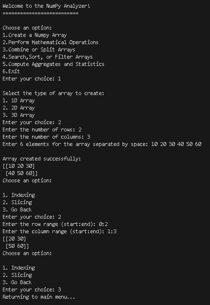
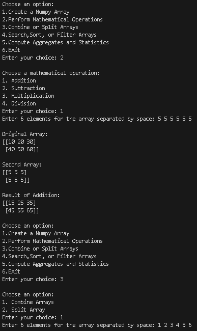
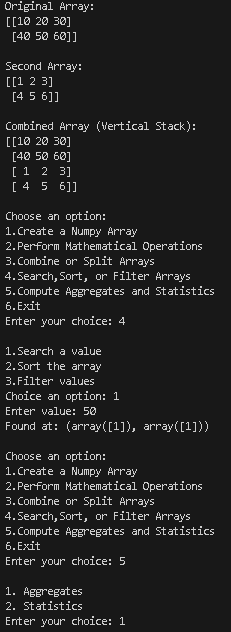
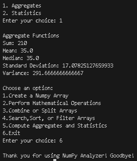

# Analyzer

## Project Overview

The **Analyzer** is a Python-based console application developed using **NumPy** and **Object-Oriented Programming (OOP)** concepts. The project provides an interactive menu-driven interface that allows users to create NumPy arrays and perform different operations such as mathematical calculations, array manipulation, searching, sorting, filtering, and statistical analysis.

This project demonstrates the implementation of **constructors, encapsulation, class methods, static methods, and NumPy functionalities** within an OOP structure.

---

## Features

### 1. Create NumPy Arrays

Allows users to create different types of arrays:

* 1D Array
* 2D Array
* 3D Array

Supports user input for array elements.

---

### 2. Indexing and Slicing

Provides functionality for:

* Accessing individual elements using indexing
* Extracting subsets of arrays using slicing
* Accessing rows and columns in 2D arrays

---

### 3. Combine and Split Arrays

Supports:

* Combining arrays using Vertical Stack (`vstack`)
* Splitting arrays into smaller parts using `array_split()`

---

### 4. Mathematical Operations

Performs element-wise operations:

* Addition
* Subtraction
* Multiplication
* Division

Displays:

* Original Array
* Second Array
* Result of operation

---

### 5. Search, Sort, and Filter

Provides the following functionalities:

#### Search

* Search specific values in an array
* Display positions of matched elements

#### Sort

* Sort arrays in:

  * Ascending order
  * Descending order

#### Filter

* Display values greater than a user-defined value

---

### 6. Aggregates and Statistics

Computes aggregate functions:

* Sum
* Mean
* Median
* Standard Deviation
* Variance

Provides statistical functions:

* Minimum value
* Maximum value
* Percentile calculation
* Correlation coefficient between arrays

---

### 7. Exit Program

* Safely exits the application.

---

## Concepts Demonstrated

### Object-Oriented Programming (OOP)

The project uses:

* Classes and Objects
* Constructor (`__init__`)
* Encapsulation using private methods
* Class Methods
* Static Methods

---

### NumPy Functions Used

The project uses:

* `np.array()`
* `reshape()`
* `vstack()`
* `array_split()`
* `where()`
* `sort()`
* `sum()`
* `mean()`
* `median()`
* `std()`
* `var()`
* `min()`
* `max()`
* `percentile()`
* `corrcoef()`

---

### User Defined Functions (UDF)

Functions created in the project:

```python
project_info()
input_elements()
create_array()
indexing_slicing()
combine_split()
math_operations()
search_sort_filter()
aggregate_functions()
statistical_functions()
```

### Encapsulation

Private method used:

```python
def __validate_array(self):
```

### Class Method

Used in:

```python
@classmethod
def project_info(cls):
```

### Static Method

Used in:

```python
@staticmethod
def input_elements(size):
```

---

## Program Flow

1. User starts the application.
2. Main menu is displayed.
3. User creates a NumPy array.
4. User selects desired operations.
5. Program processes data using NumPy functions.
6. Results are displayed.
7. User may continue with different operations.
8. User exits the application.

---

## Menu Structure

```text
Choose an option:

1.Create a Numpy Array
2.Perform Mathematical Operations
3.Combine or Split Arrays
4.Search,Sort, or Filter Arrays
5.Compute Aggregates and Statistics
6.Exit
```

---

## Requirements

Install NumPy before running the program:

```bash
pip install numpy
```

---

## Output Screenshots

### Output 1


### Output 2


### Output 3


### Output 4


---

## Project Demo Video

Watch the complete project demonstration here:

[▶ Watch Demo Video](Paste Video Link Here)

---

## Author

**Sarth Thakar**
